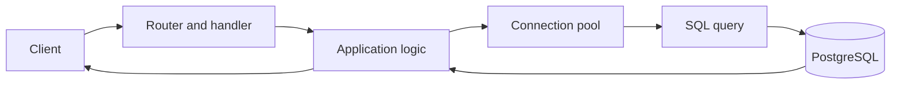
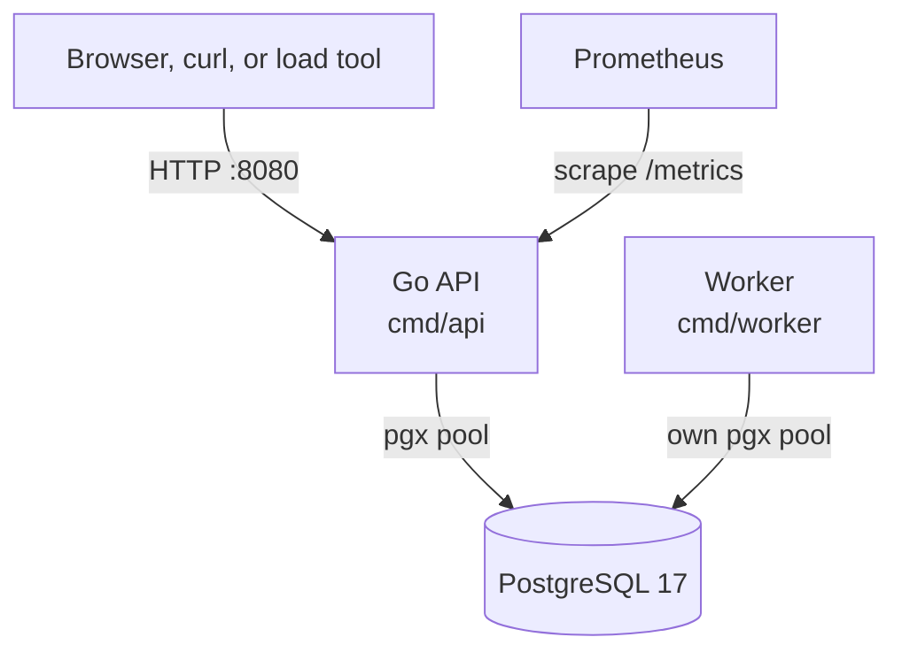
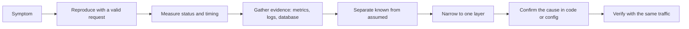
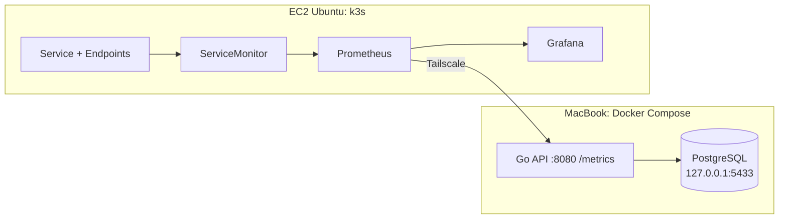

# Production Troubleshooting Lab

A real Go + PostgreSQL airline-booking API with switchable, intentional faults, built for practicing production troubleshooting the way it actually happens: a vague complaint, a dashboard that looks fine, and a request you have to follow from the client all the way to the database.

- **What you practice:** reproducing a symptom with valid requests, reading latency, CPU, and pool metrics, correlating request IDs with logs, inspecting PostgreSQL sessions, and only then naming a cause.
- **What is real:** HTTP routing, authentication, SQL, transactions, row locks, idempotency, connection pools, and Prometheus metrics. Only the faults are staged, and they are off by default.
- **Where to start:** [set up the lab](#running-the-lab), then open the [CPU incident](docs/labs/cpu.md) or the [seat-hold latency incident](docs/labs/booking-latency.md).

> You don't need to be a backend or database engineer to work in Cloud, DevOps, or SRE. But knowing roughly what happens between "request received" and "response sent" (handlers, SQL, transactions, connection pools) is what turns "the server is slow" into a question you can answer.

## Contents

- [Why backend and database basics matter](#why-backend-and-database-basics-matter)
- [Who this is for](#who-this-is-for) · [What you'll learn](#what-youll-learn)
- [Architecture](#architecture) · [Observability](#observability)
- [Troubleshooting workflow](#troubleshooting-workflow) · [The labs](#the-labs)
- [Lessons from building the lab](#lessons-from-building-the-lab)
- [Prometheus and Grafana on k3s](#prometheus-and-grafana-on-k3s)
- [Running the lab](#running-the-lab) · [Useful commands](#useful-commands)
- [Troubleshooting principles](#troubleshooting-principles) · [Repository structure](#repository-structure) · [Documentation map](#documentation-map)

## Why backend and database basics matter

Most production incidents land on the on-call engineer as a symptom: latency went up, CPU spiked, users see errors while the infrastructure dashboards stay green. To get from a symptom to a cause, you need a working model of the request path:



Every box is a place where time can go. The goal isn't to write the code. You need to know which evidence points at which box:

| If you suspect… | Look for |
| --- | --- |
| CPU-heavy code | Process CPU rising with *valid* request volume; other endpoints unaffected |
| Memory pressure | RSS and heap trends, GC activity, container limits, restarts |
| Slow database work | Active statements, wait events, query plans, database CPU and I/O |
| Connection pool contention | Acquired connections near the maximum, rising acquisition waits |
| Locks or long transactions | `pg_blocking_pids`, transaction age, lock wait events |
| Network problems | Connect time vs total time, interface bindings, reachability from the scraper |
| Waiting on something | High duration with low CPU; then find out *what* it waits on |
| Plain high traffic | Request rate, in-flight requests, and resource use rising together |

None of these is a diagnosis on its own. They tell you where to look next.

## Who this is for

Cloud engineers, DevOps engineers, junior SREs, production support engineers, and backend developers curious about observability. This isn't a backend course. It covers just enough application and database behavior to troubleshoot systems you didn't write.

## What you'll learn

- Follow one HTTP request through the handler, the pool, and PostgreSQL.
- Tell CPU-bound slowness apart from waiting.
- Read Prometheus counters, rates, histograms, and p95 without over-trusting them.
- Use pool metrics and `pg_stat_activity` to see what a connection is doing.
- Correlate a response's `X-Request-ID` with the server's access log.
- Debug Docker port bindings and host-vs-container networking.
- Scrape a laptop API from Prometheus on k3s over a private Tailscale network.
- Keep "what we know" separate from "what we assume" until the evidence settles it.

## Architecture



**Code facts:**

- The API serves the JSON routes under `/v1`, the embedded web UI at `/`, `/healthz`, `/readyz`, and `/metrics` (`cmd/api/main.go`).
- Flight search is public. Quotes, bookings, passengers, and seat holds require a bearer token.
- The worker expires seat holds and delivers outbox events. It has its own connection pool.
- The local Compose file runs `api`, `worker`, and `postgres`. PostgreSQL is published only on `127.0.0.1:5433`.

For the booking flow and design decisions, see [architecture](docs/architecture.md).

## Observability

`/metrics` exports HTTP request counts and duration histograms labeled by `method`, `route`, and `status`, in-flight requests, Go runtime and process metrics, and the API's pgx pool statistics. The `route` label is the router pattern, for example `POST /v1/bookings/{booking_id}/seat-holds`, never the raw path, so booking IDs don't create new time series. Access logs are JSON lines with `request_id`, `status`, and `duration_ms`. Tracing is an interface only, with no backend wired in. Full metric reference and PromQL: [observability](docs/observability.md).

### Health checks vs user experience

| Check | What it actually tests |
| --- | --- |
| `GET /healthz` | The process answers HTTP. It doesn't touch the database. |
| `GET /readyz` | The API can ping PostgreSQL within two seconds. |
| Prometheus `up=1` | The last scrape of `/metrics` succeeded. |

None of them books a seat. An API can pass all three while the one request customers care about takes seconds. Monitor the business routes' latency and error rate next to the health checks. Both labs are built around this gap.

### The Four Golden Signals

| Signal | Where to see it here |
| --- | --- |
| Latency | `http_request_duration_seconds`: p95/p99 per route, successful requests only |
| Traffic | `rate(http_requests_total[1m])` by route |
| Errors | The `status` label. Treat 400, 409, 429, and 5xx separately. |
| Saturation | Pool acquired vs max, in-flight requests, CPU vs available cores, memory vs limits |

## Troubleshooting workflow



The long version, with an incident-record template, is in [the investigation method](docs/troubleshooting-method.md).

## The labs

Each lab is a guided investigation in ten steps: symptom, what to check first, where to look next, commands and metrics, what each result means, known vs assumed, narrowing layer by layer, root cause, fix and verification, and the key lesson. The cause is always at step 8, so work through the evidence first.

| Lab | Reported symptom | Fault switch |
| --- | --- | --- |
| [1: CPU](docs/labs/cpu.md) | "Flight search is slow and the API is running hot." | `LAB_FAULTS=cpu` |
| [2: Seat-hold latency](docs/labs/booking-latency.md) | "Hold seat spins for seconds, but monitoring is green." | `LAB_FAULTS=booking-latency` |
| [3: Flight-details latency](docs/labs/flight-details-latency.md) | "Opening a flight takes two seconds; search is instant." | `LAB_FAULTS=latency` |
| [4: Container crash loop](docs/labs/environment-incidents.md#incident-4-the-api-container-keeps-restarting) | "The API container keeps restarting." | Environment |
| [5: Ping works, scrape fails](docs/labs/environment-incidents.md#incident-5-ping-works-but-prometheus-cant-scrape-the-api) | "Prometheus can't reach the API." | Environment |

Start with the [incident index](docs/lab.md), which also has a triage flowchart for the first ten minutes of any "it's slow" ticket.

## Lessons from building the lab

These came up while setting the lab up and monitoring it. They're worth reading even if you skip the labs.

### The fast load test that was all HTTP 400

**Lab observation:** an early load test against flight search showed great throughput and tiny latency. Every response was `400 invalid_input`.

**Code fact:** `GET /v1/flights` requires `origin`, `destination`, and `date` (`YYYY-MM-DD`). Validation rejects anything else before any SQL runs (`internal/flight/store.go`). The test was measuring how fast the API says no.

**Lesson:** read status codes and a sample response body before you trust a benchmark. Throughput without a status breakdown means little. Details in [Lab 1](docs/labs/cpu.md#2-what-should-i-check-first).

### Docker bind address: reachable host, refused port

**Lab observation:** Prometheus on EC2 could reach the Mac over Tailscale, but connections to port 8080 were refused. Compose published the API as `127.0.0.1:8080:8080`, so it listened only on loopback. Later, when the mapping was changed to the Tailscale IP only, the reverse happened: `curl http://127.0.0.1:8080` on the Mac got "connection refused" while the Tailscale address worked.

**Code fact:** the port mapping is now `${API_BIND_ADDR:-127.0.0.1}:8080:8080`. A published port listens only on the address you give it.

**Lesson:** "ping works" proves a route, not a listener. Check `docker compose ps` or `lsof -nP -iTCP:8080 -sTCP:LISTEN` and test the exact URL the client uses. See [networking](docs/networking.md).

### Host vs container PostgreSQL address

**Lab observation:** the API container crash-looped, and its only log line was `"msg":"application stopped","code":"startup_failed"`. Its `DATABASE_URL` pointed to `127.0.0.1:5433`, which is correct on the Mac and wrong inside a container.

**Code fact:** inside a container, `localhost` is the container itself. Compose passes `CONTAINER_DATABASE_URL` (`postgres:5432`) to the API and worker as `DATABASE_URL`. Host tools use `DATABASE_URL` (`127.0.0.1:5433`). Startup logs use fixed error codes on purpose, so they never print connection strings.

**Lesson:** when logs are deliberately terse, inspect the effective configuration, with secrets masked, instead of guessing. See [database troubleshooting](docs/database-troubleshooting.md#first-connect-to-the-right-database).

### Private networking with Tailscale

The laptop has no public address and shouldn't get one. Both machines join a Tailscale network, and Prometheus scrapes the Mac's `100.x.y.z` address. Only the API's port is published there; PostgreSQL stays on localhost. Use your own Tailscale IP wherever the docs say `YOUR_MAC_TAILSCALE_IP`. See [networking](docs/networking.md).

## Prometheus and Grafana on k3s

**Reported setup:** the API and PostgreSQL ran on a MacBook under Docker Compose. An Ubuntu EC2 instance ran k3s with the `kube-prometheus-stack` Helm chart (Prometheus Operator, Prometheus, Grafana, Alertmanager), and Prometheus scraped the Mac over Tailscale.



The original cluster objects and dashboards weren't saved in this repository. [docs/monitoring/external-api.yaml](docs/monitoring/external-api.yaml) is an example selectorless Service, Endpoints, and ServiceMonitor that reproduces the setup. Walkthrough: [Prometheus and Grafana](docs/monitoring/prometheus-grafana.md). Everything in the labs also works with no remote monitoring at all.

## Running the lab

Run everything from the repository root, with fictional data only. More detail, including running the API on the host instead of in Docker, is in [running the lab](docs/running.md).

**1. Tools:** Docker with Compose, Go 1.26.8 (from `go.mod`), PostgreSQL client tools (`psql`, `createdb`, `pg_isready`), `curl`, `jq`, `uuidgen`, and Goose. `hey` is optional for load.

```sh
go install github.com/pressly/goose/v3/cmd/goose@v3.28.0
export PATH="$(go env GOPATH)/bin:$PATH"
test -e .env || cp .env.example .env
```

**2. Configure `.env`:** replace the placeholder password in `POSTGRES_PASSWORD`, `DATABASE_URL`, and `CONTAINER_DATABASE_URL`. Keep `POSTGRES_DB=airline_booking_demo`; the seeder refuses any other database. `.env` is git-ignored. Compose reads it; your shell and `go run` don't.

**3. Start PostgreSQL, migrate, and seed:**

```sh
docker compose up -d postgres
DEMO_SEED_ONLY=1 sh scripts/demo-local.sh
```

This creates `airline_booking_demo` if needed, applies the migrations, and seeds CAI↔DXB/LHR/JED/ASW flights for the next seven UTC days.

**4. Start the API and worker with no faults:**

```sh
LAB_FAULTS= docker compose --profile app up -d --build api worker
export B=http://127.0.0.1:8080
curl --fail-with-body "$B/readyz"
curl -s "$B/metrics" | head
```

Open `$B/` in a browser and use **Try a demo account** to walk through the booking UI.

**5. Enable one fault at a time.** Faults are read at startup, so recreate the container:

```sh
LAB_FAULTS=cpu docker compose --profile app up -d --force-recreate api
docker compose logs api | grep lab_faults      # confirms what is active
LAB_FAULTS= docker compose --profile app up -d --force-recreate api   # back to baseline
```

**6. Optional:** set `API_BIND_ADDR` to your Tailscale IP in `.env` and follow [Prometheus and Grafana](docs/monitoring/prometheus-grafana.md).

## Useful commands

```sh
# A valid search, with timing
DATE=$(date -u -v+1d +%F 2>/dev/null || date -u -d tomorrow +%F)
curl -sS -o /dev/null -w 'status=%{http_code} ttfb=%{time_starttransfer}s total=%{time_total}s\n' \
  "$B/v1/flights?origin=CAI&destination=JED&date=$DATE"

docker stats                                   # API vs PostgreSQL CPU and memory
docker compose logs --since 5m api             # JSON access logs with request_id
docker compose exec postgres sh -c 'psql -U "$POSTGRES_USER" -d airline_booking_demo'
```

The full sheet (Docker, HTTP, PostgreSQL, PromQL, Kubernetes, networking) is in [commands](docs/commands.md).

## Troubleshooting principles

- Reproduce with a request you know is valid. Check the status and body first.
- Measure before you change anything, and compare against a fault-free baseline.
- High latency doesn't mean high CPU, and UP doesn't mean fast.
- Compare the slow path with a nearby healthy one.
- Follow one request ID end to end.
- A healthy database can still be used badly by the application, and the reverse happens too.
- Write down what you know and what you only assume. Promote an assumption only with evidence.
- Verify a fix with the same traffic you used to find the problem.

## Repository structure

| Path | Contents |
| --- | --- |
| `cmd/api`, `cmd/worker`, `cmd/seed-demo` | HTTP server and `/metrics`; hold-expiry and outbox worker; demo data seeder |
| `internal/httpapi` | Routes, middleware, request IDs, timeouts, rate limits |
| `internal/booking` | Booking lifecycle, seat holds, locking, expiry |
| `internal/flight`, `internal/quote` | Flight search, seat maps, priced quotes |
| `internal/auth`, `internal/payment`, `internal/outbox` | Sessions and tokens, payment abstraction, event outbox |
| `internal/database`, `internal/idempotency` | Pool settings and timeouts; idempotency keys |
| `internal/observability` | Prometheus instruments, pool collector, logger |
| `internal/lab` | The `LAB_FAULTS` switch |
| `internal/webui` | Embedded browser UI and assets |
| `internal/demo`, `internal/testsupport` | Seed fixtures, test database helpers |
| `migrations`, `ops` | Goose migrations; roles, grants, retention SQL |
| `scripts` | Demo, test, and smoke runners; `lab-booking-setup.sh` |
| `deploy` | Earlier AWS/EC2 application deployment (separate from the monitoring lab) |
| `api/openapi.json` | API reference for the `/v1` routes |
| `docker-compose.yml`, `Dockerfile`, `.env.example` | Local stack, image build, example configuration |
| `docs` | Labs, method, observability, networking, monitoring, reference |

## Documentation map

| Topic | Document |
| --- | --- |
| Labs | [Incident index](docs/lab.md) · [CPU](docs/labs/cpu.md) · [Seat-hold latency](docs/labs/booking-latency.md) · [Flight-details latency](docs/labs/flight-details-latency.md) · [Environment incidents](docs/labs/environment-incidents.md) |
| Method | [Investigation method](docs/troubleshooting-method.md) |
| Setup | [Running the lab](docs/running.md) · [Commands](docs/commands.md) |
| Signals | [Observability and PromQL](docs/observability.md) · [Database and pool troubleshooting](docs/database-troubleshooting.md) |
| Networking and monitoring | [Private networking](docs/networking.md) · [Prometheus and Grafana on k3s](docs/monitoring/prometheus-grafana.md) · [Example manifest](docs/monitoring/external-api.yaml) |
| Application reference | [Architecture](docs/architecture.md) · [ERD](docs/erd.md) · [API examples](docs/api-examples.md) · [Performance](docs/performance.md) · [Security](docs/security.md) |
| History | [AWS application deployment](docs/aws-deployment.md) · [Delivery report](docs/delivery.md) · [Changed files](docs/changed-files.md) · [Documentation notes](docs/documentation-notes.md) (contains spoilers) |
