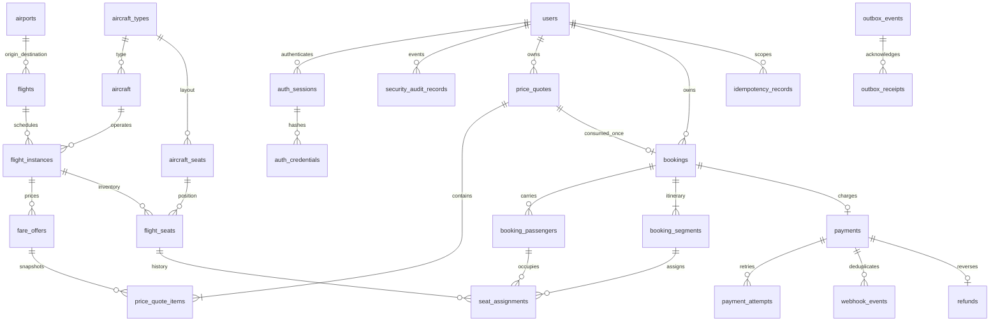

# Entity relationships

Only one active assignment may exist per seat or passenger/segment. An outbox aggregate
ID references a booking or payment logically, allowing one queue for both domain types.
