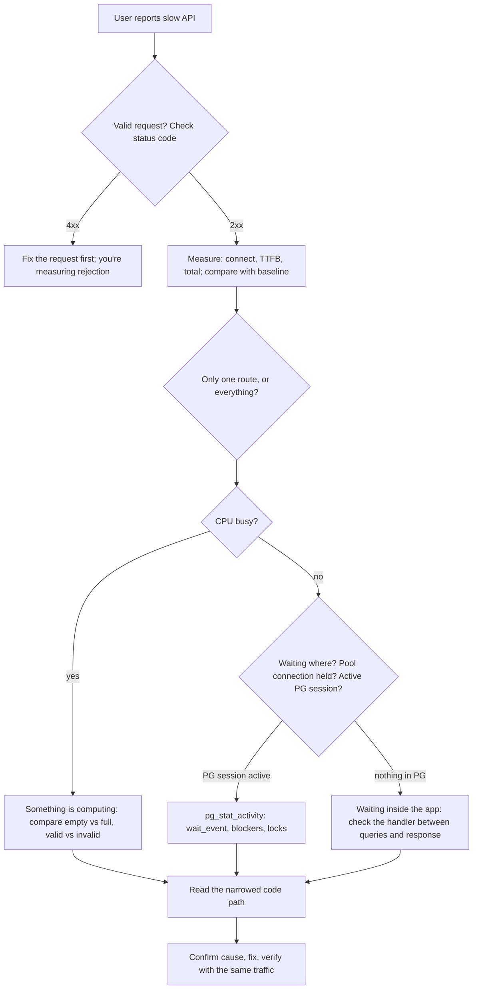

# Incident walkthroughs

[Back to the README](../README.md) · [Set up the lab first](running.md) · [Investigation method](troubleshooting-method.md)

Each walkthrough is written as a live investigation, in the same ten steps: symptom, what to check first, where to look next, which commands, metrics, and logs to use, what each result means, known vs assumed, narrowing layer by layer, root cause, fix and verification, and the key lesson. The cause is always at step 8. Try to name it before you get there.

| # | Reported symptom | Switch | Walkthrough |
| --- | --- | --- | --- |
| 1 | "Flight search is slow and the API is running hot." | `LAB_FAULTS=cpu` | [CPU incident](labs/cpu.md) |
| 2 | "Hold seat spins for seconds, but monitoring is green." | `LAB_FAULTS=booking-latency` | [Seat-hold incident](labs/booking-latency.md) |
| 3 | "Opening a flight takes two seconds; search is instant." | `LAB_FAULTS=latency` | [Flight-details incident](labs/flight-details-latency.md) |
| 4 | "The API container keeps restarting." | None; environment | [Environment incidents](labs/environment-incidents.md#incident-4-the-api-container-keeps-restarting) |
| 5 | "Ping works, but Prometheus can't scrape the API." | None; environment | [Environment incidents](labs/environment-incidents.md#incident-5-ping-works-but-prometheus-cant-scrape-the-api) |

A good order is 1 → 2 → 3. Incidents 2 and 3 start out looking the same (slow, successful, low CPU), and working them back to back shows how one extra measurement sends the investigation in a different direction.

## The first ten minutes of any "it's slow" ticket

This is the triage path all three application incidents follow. Each walkthrough leaves it at a different box.

Keep one rule in mind throughout: **open the code only after the evidence has narrowed it to one route and one phase.** Before that, you're guessing.
