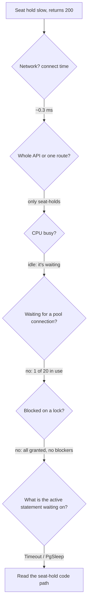

# Incident 2: "Hold seat spins for seconds, but monitoring is green"

[All incidents](../lab.md) · [Back to the README](../../README.md) · [Database troubleshooting](../database-troubleshooting.md) · [Metrics and PromQL](../observability.md)

This is written as I'd work it on call, one step at a time, saying why each step comes next. The cause is at step 8.

- **Observed:** one run on a MacBook. Your numbers will differ.
- **Code fact:** something you can read in this repository.

**Setup:** finish [running the lab](../running.md), then:

```sh
export B=${B:-http://127.0.0.1:8080}
export DATE=$(date -u -v+1d +%F 2>/dev/null || date -u -d tomorrow +%F)
LAB_FAULTS=booking-latency docker compose --profile app up -d --force-recreate api
curl --fail-with-body "$B/readyz"                # retry until ready
docker compose logs api | grep lab_faults        # expect ["booking-latency"]
```

`docker compose restart` won't pick up a new `LAB_FAULTS` value. The container has to be recreated.

---

## 1. Symptom

> "Customers say *Hold seat* spins for a couple of seconds before it confirms. It does work and nobody lost a seat. Everything else feels normal. Monitoring is all green."

Two details stand out: **it works but it's slow**, and **monitoring is green**. So I shouldn't expect errors, and the existing dashboards aren't measuring what the users feel. My first job is to measure that one request myself.

## 2. What should I check first?

**Reproduce the exact user action with a valid request.** A seat hold isn't a one-liner. It needs a logged-in user, a quote, a DRAFT booking, a passenger, and a free seat in the right cabin. If I skip any of that, I'll get a fast 4xx and measure the wrong thing.

The repo has a helper that does the whole flow with a random fictional account ([`scripts/lab-booking-setup.sh`](../../scripts/lab-booking-setup.sh)). It prints shell exports and doesn't hold the seat:

```sh
out=$(B="$B" DATE="$DATE" sh scripts/lab-booking-setup.sh) && eval "$out"; unset out
echo "$BOOKING_ID"          # should be a UUID; if you saw "lab setup: …", stop and fix that
```

`TOKEN` is a live access token (valid for 10 minutes), so don't paste it anywhere.

Now the actual user action:

```sh
curl -sS -D - -o /dev/null -X POST "$B/v1/bookings/$BOOKING_ID/seat-holds" \
  -H "Authorization: Bearer $TOKEN" -H 'Content-Type: application/json' \
  -H "Idempotency-Key: $(uuidgen)" --data "$HOLD_BODY" \
  -w 'status=%{http_code} connect=%{time_connect}s ttfb=%{time_starttransfer}s total=%{time_total}s\n' \
  | grep -iE '^x-request-id|^status='
```

**Observed:**

```text
X-Request-Id: 2653aa7a4e9723a5c427362de4dda1e2
status=200 connect=0.000280s ttfb=2.351411s total=2.352500s
```

Reproduced: a **200 after 2.35 s**. I save the request ID. It's the thread I'll pull through the logs.

> The idempotency key has to be 16–128 printable ASCII characters. A short key like `test1` gets a fast `400 invalid_input` and never reaches the hold code. That's the same trap as benchmarking 400s in [incident 1](cpu.md#2-what-should-i-check-first).

## 3. Where should I look next?

Before digging in, I want to know two things: **is it only this endpoint**, and **is the network involved?**

The connect time already answers the network question: 0.00028 s. And since TTFB ≈ total, the time is spent before the first response byte, while the server is working.

Now I compare the healthy neighbors: same user, same token, same booking, same database:

```sh
curl -sS -o /dev/null -H "Authorization: Bearer $TOKEN" -w 'booking GET status=%{http_code} total=%{time_total}s\n' "$B/v1/bookings/$BOOKING_ID"
curl -sS -o /dev/null -H "Authorization: Bearer $TOKEN" -w 'seats GET   status=%{http_code} total=%{time_total}s\n' "$B/v1/bookings/$BOOKING_ID/seats"
curl -sS -o /dev/null -w 'healthz=%{http_code} ' "$B/healthz"; curl -sS -o /dev/null -w 'readyz=%{http_code}\n' "$B/readyz"
```

**Observed:** booking GET about 7 ms, seats GET about 4 ms, `healthz=200 readyz=200`.

```text
                     same user · same token · same booking · same DB
GET  /bookings/{id}          ~7 ms   ✅
GET  /bookings/{id}/seats    ~4 ms   ✅
POST /bookings/{id}/seat-holds  ~2,350 ms  ❌
/healthz, /readyz            200     ✅  ← why monitoring is green
```

That rules out a lot: auth, the network, "the whole database is slow", and "the API is overloaded". Whatever it is lives in the **seat-hold path only**.

Why are health checks green? `/healthz` only checks that the process answers, and `/readyz` only pings PostgreSQL (`cmd/api/main.go`). Neither one holds a seat.

## 4. What commands, metrics, and logs should I use?

I'll check each layer while a hold is **in flight**, so I start a hold in one terminal and sample in another during the roughly 2-second window. For a steadier stream, see [generating steady traffic](#generating-steady-traffic).

**App logs, by request ID:**

```sh
docker compose logs --no-log-prefix api | grep 2653aa7a4e9723a5c427362de4dda1e2   # use your ID
```

**CPU, memory, and the pool:**

```sh
docker stats --no-stream go-airline-booking-api-1 airline-postgres
curl -s "$B/metrics" | grep -E '^(db_pool_acquired_connections|db_pool_max_connections|http_requests_in_flight) '
```

**PostgreSQL: what is each connection doing right now?**

```sh
docker compose exec postgres sh -c 'psql -U "$POSTGRES_USER" -d airline_booking_demo'
```

```sql
-- sessions: state, wait, transaction age, blockers, query
SELECT pid, state, wait_event_type, wait_event,
       clock_timestamp() - xact_start AS xact_age,
       pg_blocking_pids(pid) AS blockers,
       left(query, 120) AS query
FROM pg_stat_activity
WHERE datname = current_database() AND pid <> pg_backend_pid() AND state <> 'idle';

-- locks held by those sessions
SELECT l.locktype, l.mode, l.granted, count(*)
FROM pg_locks l JOIN pg_stat_activity a USING (pid)
WHERE a.datname = current_database() AND a.pid <> pg_backend_pid() AND a.state <> 'idle'
GROUP BY 1, 2, 3 ORDER BY 1, 2;
```

Type `\watch 1` after a query to rerun it every second.

**Prometheus** (if set up):

```promql
histogram_quantile(0.95, sum by (le) (rate(http_request_duration_seconds_bucket{
  job="mac-go-api",route="POST /v1/bookings/{booking_id}/seat-holds",status="200"}[5m])))
```

## 5. What does each result mean?

**App log.** Observed: `"status":200,"duration_ms":2347`. The server measured the same 2.35 s as my client, so the time is inside the API's request handling. The log has no per-stage timings and there's no tracing, so it can't say *which* stage. I have to look at the dependencies.

**CPU.** Observed: API about 0.5%, PostgreSQL about 2.9%. **Nobody is working.** High latency with idle CPU means the request is **waiting** on something. That's the most important fork in the whole investigation:

```text
slow + high CPU  → something is computing       (incident 1)
slow + low CPU   → something is waiting         ← we are here
                   on what? network · pool · lock · statement · timer
```

**Pool.** Observed: `db_pool_acquired_connections 1` of max 20, `http_requests_in_flight 1`. One request, one connection checked out. So the request *does* have a database connection during the wait, and it isn't queuing for one.

**PostgreSQL sessions.** Observed, sampled mid-hold:

```text
state=active | wait_event_type=Timeout | wait_event=PgSleep | xact_age=0.85s | blockers={}
query: SELECT count(*) FROM (SELECT pg_sleep($2)) AS settle, flight_seats AS fs LEFT JOIN seat_a…
```

**Locks.** Observed: 13 × `relation AccessShareLock` (ordinary reads) and 1 × `virtualxid ExclusiveLock` (every transaction holds one). **All granted.** No row locks, nothing waiting.

How to read the PostgreSQL columns:

| Column | Value seen | Meaning |
| --- | --- | --- |
| `state` | `active` | A statement is executing. That doesn't mean the CPU is busy. |
| `wait_event_type` / `wait_event` | `Timeout` / `PgSleep` | The statement is waiting on a **timer**: it called `pg_sleep()` |
| `blockers` | `{}` | No other session blocks it |
| `xact_age` | growing | A transaction is open the whole time |

If it had been a lock problem, I'd have seen `wait_event_type = Lock`, a `granted = false` row, and a non-empty `blockers`.

## 6. What do we know vs what are we only assuming?

| Known (measured) | Only assumed / ruled out |
| --- | --- |
| Hold takes ~1–2.5 s and returns 200 | ~~"Network is slow"~~: connect time is ~0.3 ms |
| Only the hold path is slow | ~~"DB is overloaded"~~: other DB-backed calls are fast, PG CPU is ~3% |
| Health checks never exercise the hold | ~~"Pool exhausted"~~: 1 of 20 in use |
| CPU is idle, so the request is waiting | ~~"Lock contention"~~: all locks granted, no blockers |
| PostgreSQL is running a statement that waits on `PgSleep` inside an open transaction | **Why** the hold code sends that statement |

Early on, "it's a DB problem" was the tempting guess. It's half right: the wait happens *in* PostgreSQL, but PostgreSQL isn't struggling. It's doing exactly what it was asked to do. The question has moved from the database to the application: who asks it to sleep?

## 7. How do I narrow the problem layer by layer?

This is the path I took, with the result at each fork:



**When to open the code:** now, and not earlier. I know the route (`POST /v1/bookings/{booking_id}/seat-holds`), I know it's a SQL statement containing `pg_sleep` that runs over `flight_seats` and `seat_assignments`, and I know it runs inside a transaction. That's specific enough to go straight to the right function:

```sh
grep -rn 'pg_sleep' --include='*.go' internal/
```

The route handler in `internal/httpapi/booking.go` calls `HoldSeats` in `internal/booking/hold_seats.go`. Reading `HoldSeats` from the top, the first thing after `BeginTx` is a call to `reconcileHeldInventory`.

## 8. Root cause

**Code fact:** [`HoldSeats`](../../internal/booking/hold_seats.go) begins a READ COMMITTED transaction, which checks out a pool connection. Before the idempotency check and before any row locks, it calls [`reconcileHeldInventory`](../../internal/booking/inventory_reconcile.go). When `LAB_FAULTS` contains `booking-latency`, that function picks a random delay between 1 and 3 seconds and runs:

```sql
SELECT count(*)
FROM (SELECT pg_sleep($2)) AS settle,
     flight_seats AS fs
     LEFT JOIN seat_assignments AS sa
       ON sa.flight_seat_id = fs.id AND sa.status = 'HELD'
WHERE fs.flight_instance_id = $1
  AND fs.state = 'HELD';
```

The count is scanned into a variable and thrown away. Despite the name and the comment, nothing gets reconciled. Afterwards the real hold logic runs normally: locks, availability checks, writes, commit.

```text
POST /seat-holds
  └─ BeginTx  ─────────────── pool connection checked out ───────────────┐
      ├─ reconcileHeldInventory → SELECT … pg_sleep(1–3 s)   ← the wait   │
      ├─ idempotency check                                               │
      ├─ lock booking, seats (FOR UPDATE)                                │
      ├─ write seat_assignments, flight_seats, bookings                  │
      └─ COMMIT ─────────────────────────────── connection returned ─────┘
```

Every observation fits:

| Observation | Explained by |
| --- | --- |
| Slow but always 200 | The real hold logic is untouched |
| 1–3 s, varies | Random sleep duration |
| CPU idle | PostgreSQL is sleeping, not working |
| One pool connection in use | Held by the open transaction during the sleep |
| No lock waits | The sleep runs *before* the hold takes row locks |
| `Timeout/PgSleep` | Literally `pg_sleep()` |
| Health checks and other endpoints fine | Only `HoldSeats` calls it |

**Observed**, testing the query alone in `psql`: with a 0.5 s argument, it took about 0.5 s both for a flight with held seats and for one without. The sleep runs either way.

## 9. Fix / verification

Turn the fault off. In real code, you'd delete the pointless query, and in general you'd keep slow or external calls *outside* open transactions.

```sh
LAB_FAULTS= docker compose --profile app up -d --force-recreate api
curl --fail-with-body "$B/readyz"
```

Then repeat **the same hold** (the token lasts 10 minutes, so rerun the setup helper if you get a 401) and the same neighbor comparison from step 3.

**Observed** after the fix: the hold returned `200` in about **0.024 s**. That's a bit slower than a GET because it locks and writes rows, but it's nowhere near seconds. During a hold, `pg_stat_activity` no longer shows a `PgSleep` session. In Prometheus, compare seat-hold p95 over a fresh window.

Release the seat when you're done:

```sh
curl -sS -o /dev/null -w 'release status=%{http_code}\n' -X DELETE "$B/v1/bookings/$BOOKING_ID/seat-holds" \
  -H "Authorization: Bearer $TOKEN" -H "Idempotency-Key: $(uuidgen)"
unset TOKEN HOLD_BODY
```

Holds you don't release expire after 15 minutes, and the worker cleans them up.

## 10. Key lesson

- **UP is not fast.** Everything was green because no health check exercises the business action. Measure the route users actually complain about.
- **Low CPU plus high latency means waiting.** Then find *what* it waits on, one layer at a time: network, pool, lock, statement.
- **`pg_stat_activity.wait_event` is the fastest way to tell a lock wait from I/O or a timer.**
- **"The database is slow" is often "the application makes the database wait".** PostgreSQL was healthy the whole time.
- **Long transactions tie up pool connections.** Each hold keeps a connection for 1–3 s. At about 20 concurrent holds, the API's 20-connection pool runs out, and unrelated routes start queuing for connections. A bigger pool just lets more requests wait at once. (Not measured here. Try it and watch `db_pool_empty_acquires_total`.)

---

## Generating steady traffic

One booking, re-held every 10 s for 4 minutes. It stays under the 10-minute token lifetime and the rate limits (30 auth requests per IP per minute, 60 booking mutations per user per minute), and it releases the seat at the end:

```sh
(
  set -e
  out=$(B="$B" DATE="$DATE" sh scripts/lab-booking-setup.sh); eval "$out"
  for i in $(seq 1 24); do
    curl -sS -o /dev/null -X POST "$B/v1/bookings/$BOOKING_ID/seat-holds" \
      -H "Authorization: Bearer $TOKEN" -H 'Content-Type: application/json' \
      -H "Idempotency-Key: $(uuidgen)" --data "$HOLD_BODY" \
      -w "hold $i status=%{http_code} total=%{time_total}s\n"
    sleep 10
  done
  curl -sS -o /dev/null -X DELETE "$B/v1/bookings/$BOOKING_ID/seat-holds" \
    -H "Authorization: Bearer $TOKEN" -H "Idempotency-Key: $(uuidgen)" -w 'release status=%{http_code}\n'
)
```

A 401 means the token expired, a 409 means the seat went to someone else or the hold expired, and a 429 means you hit a rate limit. Stop and look at any of these. None of them is a fast successful hold.
