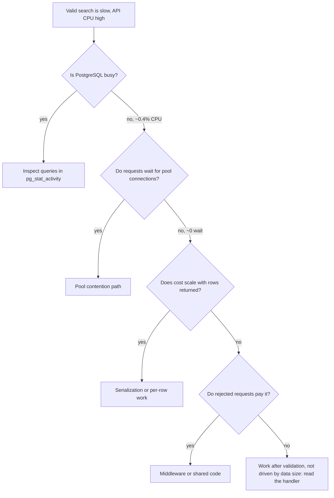

# Incident 1: "Flight search is slow and the API is running hot"

[All incidents](../lab.md) · [Back to the README](../../README.md) · [Metrics and PromQL](../observability.md)

This is written the way I'd work it on call: one check at a time, saying why each check comes next. The cause is at step 8. Try to call it before you get there.

Labels you'll see:
- **Observed:** what one run on a MacBook with 8 CPUs actually showed. Your numbers will differ.
- **Code fact:** something you can read in this repository.

**Setup (do this first):** finish [running the lab](../running.md), then start the scenario:

```sh
export B=${B:-http://127.0.0.1:8080}
export DATE=$(date -u -v+1d +%F 2>/dev/null || date -u -d tomorrow +%F)
LAB_FAULTS=cpu docker compose --profile app up -d --force-recreate api
curl --fail-with-body "$B/readyz"            # retry until {"status":"ready"}
```

---

## 1. Symptom

> "Flight search got slow after the last deploy. The API hosts are running hot."

That's everything I get. No endpoint list, no numbers, no timeline. Before touching anything, I write down what I'd want to know: *which* requests, *how* slow, *compared to what*, and *is CPU actually high or does it just feel slow?*

## 2. What should I check first?

**Whether I can reproduce it with a request I know is valid.** If I can't reproduce it, every graph I open afterwards is guesswork.

The complaint mentions search, so I start there. My first attempt is the lazy one:

```sh
curl -i "$B/v1/flights"
```

```text
HTTP/1.1 400 Bad Request
{"error":{"code":"invalid_input","message":"Invalid flight query",...}}
```

It's fast, and it's useless. A 400 means the API rejected my request before doing the real work, so its latency tells me nothing about search.

> This is exactly how the lab's first load test fooled everyone: great throughput, tiny latency, and 100% HTTP 400. Always look at the status code before the timing.

**Where do I find the valid shape?** The route is in `internal/httpapi/flight.go`, and the validation is in `Search` in `internal/flight/store.go`. It requires `origin`, `destination` (three-letter codes that differ) and `date` (`YYYY-MM-DD`). `limit` is optional, from 1 to 100.

```sh
export Q="origin=CAI&destination=JED&date=$DATE&limit=20"
curl --fail-with-body -i "$B/v1/flights?$Q"
```

Now I get `200` and an `items` array (two flights in the demo data). *Now* I can measure.

## 3. Where should I look next?

I need a number and a baseline. "Slow" means nothing until I compare it with something.

```sh
for i in 1 2 3; do
  curl -sS -o /dev/null \
    -w 'status=%{http_code} connect=%{time_connect}s ttfb=%{time_starttransfer}s total=%{time_total}s\n' \
    "$B/v1/flights?$Q"
done
```

**Observed:** `status=200 … total=0.32s`, consistently. To get a baseline, I recreate the API with `LAB_FAULTS=` and rerun: about **0.003 s**. So the same valid request is roughly **100× slower**. I set the fault back on and continue.

What these three numbers tell me:

```text
connect ≈ 0      → the network handshake is not the problem
ttfb ≈ total     → the time is spent before the server sends anything
total 0.32 s     → the server is doing ~0.3 s of *something* per request
```

The network is ruled out. The server is spending time somewhere. The ticket says "running hot", so the next question is whether that time is CPU.

## 4. What commands, metrics, and logs should I use?

I put load on it and watch both containers at the same time. I watch PostgreSQL too, because "slow search" often means "slow query":

```sh
# terminal 1: steady, modest load
hey -z 15s -c 4 "$B/v1/flights?$Q"

# terminal 2: while that runs
docker stats --no-stream go-airline-booking-api-1 airline-postgres
```

(`hey` is optional. Four parallel `curl` loops work too.)

Then logs and metrics:

```sh
docker compose logs --since 2m api | tail -3
curl -s "$B/metrics" | grep -E '^db_pool_(acquires_total|acquire_duration_seconds_total|acquired_connections) '
```

If Prometheus scrapes the API ([setup](../monitoring/prometheus-grafana.md)):

```promql
rate(process_cpu_seconds_total{job="mac-go-api"}[1m])
sum by (status) (rate(http_requests_total{job="mac-go-api",route="GET /v1/flights"}[1m]))
histogram_quantile(0.95, sum by (le) (rate(http_request_duration_seconds_bucket{job="mac-go-api",route="GET /v1/flights",status="200"}[5m])))
```

## 5. What does each result mean?

**Observed:**

| Check | Fault off | Fault on | What it tells me |
| --- | --- | --- | --- |
| `hey -c 4` throughput | ~4,870 req/s | ~11 req/s | Real, big regression |
| Status codes | all 200 | all 200 | Not an error problem. The requests are valid. |
| API CPU (`docker stats`) | ~75% | **~397%** | Four busy cores for four concurrent requests: each request keeps one core fully busy |
| PostgreSQL CPU | ~53% | **~0.4%** | The database is almost idle |
| API memory | ~13 MiB | ~16 MiB | Nothing interesting |
| Access log `duration_ms` | ~1 | ~350 | The server itself measures the slowness, so it isn't the client or the network |
| Pool acquires over 10 s of load | — | +117 acquires, +0.01 s total wait | Requests get DB connections instantly |

How to read `docker stats`: 100% = one core. 397% with `-c 4` means each in-flight request is burning a full core for its entire lifetime.

The result that changes my direction: **PostgreSQL CPU went *down*** (from ~53% to ~0.4%). If the query were slow, the database would be busy. It dropped because the API now serves about 11 requests per second instead of about 4,870, so it barely sends the database any work.

## 6. What do we know vs what are we only assuming?

| Known (I measured it) | Only assumed (not proven yet) |
| --- | --- |
| Valid searches are ~100× slower | "The search query got slow" |
| Every response is 200 | "We need an index" |
| API CPU scales with concurrency | "More CPU would fix it" |
| PostgreSQL is idle; pool waits are ~0 | "It's the database" |
| Server-side duration matches the client's | Which *part* of the handler burns CPU |

The obvious guess, "slow SQL, add an index", contradicts two measurements. I drop it.

## 7. How do I narrow the problem layer by layer?



I've already answered the first two boxes. The next two take one command each.

**Does the cost depend on how much data comes back?** I search a date with no flights:

```sh
curl -sS -o /dev/null -w 'status=%{http_code} total=%{time_total}s\n' \
  "$B/v1/flights?origin=CAI&destination=JED&date=2030-01-01"
```

**Observed:** `200`, empty `items`, **~0.29 s**. Zero rows is almost as slow as two rows, so most of the cost is a fixed amount per request.

**Do rejected requests pay it?** `curl -i "$B/v1/flights"` still returns 400 in about 1–3 ms. So the expensive part runs *after* validation.

**Is it only this route?** `GET /v1/flight-instances/{id}` uses the same store and the same database, and returns in about 5 ms. The problem is specific to the search handler.

So now I know where to look:

```text
request → validation → SQL query → [ ??? fixed, CPU-heavy work ??? ] → write response
                                      ^ here
```

**When to open the code:** now. I've narrowed it to one handler and one phase. Without that narrowing, reading code is a needle-in-a-haystack search. In a real service I'd grab a CPU profile first (`pprof`). This build doesn't expose one, so I read the handler.

In `internal/httpapi/flight.go`, the `GET /v1/flights` handler runs the query, builds the result slice, and then does one more thing before `JSON(...)`: it calls `searchETag(result)` and sets an `ETag` header.

A quick check confirms it's involved:

```sh
curl -sI "$B/v1/flights?$Q" | grep -i etag
```

With the fault on, it prints an `ETag`. With the fault off, it prints nothing.

## 8. Root cause

**Code fact:** `searchETag` in [`internal/httpapi/flight_integrity.go`](../../internal/httpapi/flight_integrity.go) only runs when `LAB_FAULTS` contains `cpu`. It:

1. JSON-encodes each result item and runs **60,000 SHA-256 rounds per item**, then
2. runs **2,400,000 more rounds** (60,000 × 40) no matter how many items there are, then
3. returns the digest as the `ETag`.

The comment calls this "hardening" the ETag. That's the injected fault, not a real technique. It explains every observation:

| Observation | Explained by |
| --- | --- |
| API CPU ~1 core per concurrent request | Pure CPU hashing loop |
| PostgreSQL idle, no pool waits | The loop runs after the query and never touches the DB |
| Empty page still ~0.29 s | The 2.4M fixed rounds dominate |
| Invalid requests fast | Validation returns before the query and the ETag |
| Flight details fast | Different handler, no ETag |

It also ignores the request context. Even when `http.TimeoutHandler` (10 s by default) gives up on a request, the hashing keeps running until it finishes. Timeouts don't protect you from this kind of work.

## 9. Fix / verification

The fix here is to turn off the fault. In real life you'd remove the work or make it cheap, and cancel it via the context.

```sh
LAB_FAULTS= docker compose --profile app up -d --force-recreate api
curl --fail-with-body "$B/readyz"
curl -sS -o /dev/null -w 'status=%{http_code} total=%{time_total}s\n' "$B/v1/flights?$Q"
hey -z 15s -c 4 "$B/v1/flights?$Q"
curl -sI "$B/v1/flights?$Q" | grep -ci etag      # 0 = no ETag header
```

I verify with the **same query and the same concurrency** I used to find the problem. **Observed** after the fix: about 0.003 s per request, about 4,870 req/s, all 200. For Prometheus, look at a fresh time window: a 5-minute `rate()` still includes samples from while the fault was on.

## 10. Key lesson

- **Check status codes before latency.** A benchmark full of 400s measures how fast you reject work.
- **High app CPU plus an idle database points into the app.** The database got *quieter* during the "slow search" incident.
- **Narrow with cheap comparisons** (empty result vs full, invalid vs valid, one route vs its neighbor) before reading code.
- **Don't fix what you didn't measure.** An index would have changed nothing.
- **CPU work that ignores cancellation keeps running after timeouts,** so it eats capacity for clients who have already given up.
