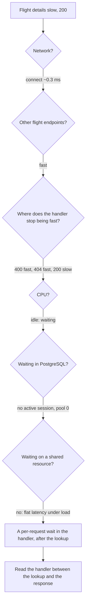

# Incident 3: "Opening a flight takes two seconds"

[All incidents](../lab.md) · [Back to the README](../../README.md) · [Metrics and PromQL](../observability.md)

This one looks a lot like [incident 2](booking-latency.md) at first: slow, successful, low CPU. The evidence takes a different turn, though. If you've done incident 2, watch for the moment the two investigations split. The cause is at step 8.

- **Observed:** one run on a MacBook. Your numbers will differ.
- **Code fact:** something you can read in this repository.

**Setup:** finish [running the lab](../running.md), then:

```sh
export B=${B:-http://127.0.0.1:8080}
export DATE=$(date -u -v+1d +%F 2>/dev/null || date -u -d tomorrow +%F)
LAB_FAULTS=latency docker compose --profile app up -d --force-recreate api
curl --fail-with-body "$B/readyz"                # retry until ready
docker compose logs api | grep lab_faults        # expect ["latency"]
```

---

## 1. Symptom

> "When I click a flight to see its fares, the page just sits there for a couple of seconds. Search results show up instantly."

The user has already done a comparison for me: search is fast, details are slow. I'll confirm it rather than trust it, but it's a good starting point.

## 2. What should I check first?

**Reproduce with a valid request and look at the status.** The details endpoint needs a real flight ID, which I get from a valid search:

```sh
export Q="origin=CAI&destination=JED&date=$DATE"
ID=$(curl -sS "$B/v1/flights?$Q" | jq -r '.items[0].id'); echo "$ID"

for i in 1 2 3; do
  curl -sS -o /dev/null \
    -w 'status=%{http_code} connect=%{time_connect}s ttfb=%{time_starttransfer}s total=%{time_total}s\n' \
    "$B/v1/flight-instances/$ID"
done
```

**Observed:**

```text
status=200 connect=0.000228s ttfb=1.901754s total=1.901994s
status=200 connect=0.000253s ttfb=2.431772s total=2.431962s
status=200 connect=0.000335s ttfb=1.971806s total=1.972063s
```

Reproduced. The response is a 200 with fares, so nothing is broken, just slow. Connect time is negligible and TTFB ≈ total, so the server spends about 2 seconds before it sends anything. The baseline with the fault off is about **0.004 s**.

## 3. Where should I look next?

**The neighbors, and the "how far does the request get?" ladder.** Different inputs make the handler stop at different points, and that tells me roughly *where* in the handler the time goes:

```sh
curl -sS -o /dev/null -w 'search      status=%{http_code} total=%{time_total}s\n' "$B/v1/flights?$Q"
curl -sS -o /dev/null -w 'seat map    status=%{http_code} total=%{time_total}s\n' "$B/v1/flight-instances/$ID/seats?limit=10"
curl -sS -o /dev/null -w 'bad id      status=%{http_code} total=%{time_total}s\n' "$B/v1/flight-instances/not-a-uuid"
curl -sS -o /dev/null -w 'unknown id  status=%{http_code} total=%{time_total}s\n' "$B/v1/flight-instances/00000000-0000-4000-8000-000000000000"
```

**Observed:**

```text
search      200  ~0.006 s   ✅ same flight data, same DB
seat map    200  ~0.013 s   ✅ same flight, same DB
bad id      400  ~0.001 s   ✅ rejected by validation
unknown id  404  ~0.002 s   ✅ looked up in the DB, not found
valid id    200  ~2 s       ❌
```

The **404** result is the useful one. A 404 means the handler validated the ID *and queried the database* for the flight, then stopped because nothing came back. That was fast. So the slow part comes *after* the flight lookup succeeds. It's not validation, and it's not the connection to PostgreSQL.

## 4. What commands, metrics, and logs should I use?

Same toolkit as always, checked **while a request is in flight** (start one in the background, then sample):

```sh
curl -s -o /dev/null "$B/v1/flight-instances/$ID" &     # ~2 s window

docker stats --no-stream go-airline-booking-api-1 airline-postgres
curl -s "$B/metrics" | grep -E '^(db_pool_acquired_connections|http_requests_in_flight|go_goroutines) '
docker compose exec -T postgres sh -c 'psql -U "$POSTGRES_USER" -d airline_booking_demo -Atc \
  "SELECT count(*) FROM pg_stat_activity WHERE datname=current_database() AND pid<>pg_backend_pid() AND state<>'\''idle'\''"'
wait
```

And under concurrency, to see whether the delay grows with load:

```sh
hey -z 10s -c 20 "$B/v1/flight-instances/$ID"
```

Logs, as always:

```sh
docker compose logs --since 1m api | tail -3      # duration_ms per request
```

## 5. What does each result mean?

**Observed** (sampled mid-request):

| Check | Value | What it tells me |
| --- | --- | --- |
| API CPU | ~0.15% | Not computing, so it's **waiting** |
| PostgreSQL CPU | ~0.03% | DB idle |
| Non-idle PostgreSQL sessions | **0** | **No statement is running in the database at all** |
| `db_pool_acquired_connections` | **0** | The request isn't holding a DB connection while it waits |
| `http_requests_in_flight` | 1 | The request is still in the API |
| Access log `duration_ms` | ~2,200 | The server itself measures the delay |

Here is where this incident splits from incident 2. There, mid-request, I found an *active* PostgreSQL session holding a pool connection and waiting on `PgSleep`. Here, **the database has nothing running and the pool has nothing checked out.** The request is waiting, and it's waiting *inside the API process*, not in PostgreSQL.

```text
                         incident 2 (seat hold)      incident 3 (flight details)
CPU                      idle                        idle
pool connection held     yes (1)                     no (0)
active PG session        yes — Timeout/PgSleep       none
→ waiting where?         in PostgreSQL               in the Go process
```

**Under load. Observed:**

```text
hey -c 20:  fastest 1.50 s · average 1.98 s · slowest 2.50 s · 9.3 req/s · 110 × 200
metrics:    http_requests_in_flight 20 · go_goroutines 70 (idle: 10) · db_pool_acquired_connections 0
```

Two things stand out:

1. **Latency doesn't grow with concurrency.** At 1 request or 20, each one takes 1.5–2.5 s. If they were competing for something shared (a lock, a pool, a single worker), the 20th would wait behind the first 19 and latency would climb. Instead each request waits by itself for about the same fixed time.
2. **Throughput is just concurrency ÷ latency:** 20 ÷ 1.98 s ≈ 10 req/s, matching the 9.3 req/s measured. That's what a fixed per-request delay looks like. (With the fault off: about 0.0026 s average and about 7,700 req/s at the same concurrency.)

Goroutines rose with in-flight requests and fell back afterwards. That's what parked requests look like, not a leak.

## 6. What do we know vs what are we only assuming?

| Known (measured) | Only assumed / ruled out |
| --- | --- |
| Only flight details is slow; search and seat map are fast | ~~"The flights table is slow"~~: search and 404 are fast |
| The slow part is after a successful flight lookup | ~~"Pool exhaustion"~~: 0 connections held during the wait |
| CPU is idle, so it's waiting | ~~"A slow query"~~: no active PG session during the wait |
| The wait is in the API process, not the DB | ~~"Contention"~~: latency is flat from 1 to 20 concurrent requests |
| Each request waits a fixed-ish 1.5–2.5 s | **What** the handler waits on after the lookup |

One more candidate for the right column: a slow *outbound* call (another service, an API). That's a real possibility at this point. I'll check it.

## 7. How do I narrow the problem layer by layer?



**Rule out the database queries completely.** The handler (`GET /v1/flight-instances/{id}` in `internal/httpapi/flight.go`) runs two queries: `Get` (the flight) and `Fares`. Both are in `internal/flight/store.go`. I can run them myself in `psql` with `EXPLAIN ANALYZE` (a read-only SELECT is safe to execute in the lab DB). **Observed:** `Get` took 0.36 ms and `Fares` took 0.16 ms. The queries aren't the problem.

**When to open the code:** now. I know the exact route, and I know the wait happens after both queries succeed and before the response is written. The handler is short:

```text
GET /v1/flight-instances/{id}
  ├─ s.Get(...)          → flight row      (fast; failing here = fast 404)
  ├─ s.Fares(...)        → fare rows       (fast; 0.16 ms in psql)
  ├─ verifyFareFreshness(r.Context())       ← the only other thing before the response
  └─ JSON(200, flight + fares)
```

`verifyFareFreshness` lives in [`internal/httpapi/flight_integrity.go`](../../internal/httpapi/flight_integrity.go). Its comment says it "waits for the upstream fare feed to confirm the cached fares are current." That sounds like the outbound-dependency theory from step 6. Before believing a comment, I check whether the service makes outbound calls at all:

```sh
grep -rnE 'http\.Client|http\.(Get|Post|NewRequest)|net\.Dial' --include='*.go' cmd internal | grep -v _test
```

It returns nothing. **Code fact:** this API has no outbound HTTP client, so there is no upstream feed to wait for.

## 8. Root cause

**Code fact:** when `LAB_FAULTS` contains `latency`, `verifyFareFreshness` computes `1500 ms + random(0–999 ms)` and blocks on a timer:

```go
select {
case <-time.After(wait):
case <-ctx.Done():
}
```

It doesn't call a downstream service, doesn't touch the database, and doesn't use CPU. It just parks the request's goroutine. It runs after the fares are loaded and after the pool connection has gone back to the pool.

| Observation | Explained by |
| --- | --- |
| 1.5–2.5 s, randomly distributed | `1500 ms + rand(1000 ms)` |
| CPU idle | A timer wait uses no CPU |
| No active PG session, pool 0 | The queries finished; the wait comes after |
| 400 and 404 fast | Those paths return before reaching it |
| Latency flat under load | Each request has its own timer; nothing is shared |
| Goroutines rise with in-flight requests | Parked goroutines waiting on timers |

Unlike the CPU incident, this wait **does** respect the request context. If the client disconnects or the 10-second request timeout fires, `ctx.Done()` releases it.

The misleading comment is part of the lesson. In real systems a comment like "waits for upstream X" can be stale, wrong, or describe a feature that was removed. Check the evidence, not the comment.

## 9. Fix / verification

Turn the fault off. In real code, you'd remove the wait, or, if there really were an upstream call, add a tight timeout, a cache, and a metric around it.

```sh
LAB_FAULTS= docker compose --profile app up -d --force-recreate api
curl --fail-with-body "$B/readyz"
curl -sS -o /dev/null -w 'status=%{http_code} total=%{time_total}s\n' "$B/v1/flight-instances/$ID"
hey -z 10s -c 20 "$B/v1/flight-instances/$ID"
```

**Observed** after the fix: a single request took about 0.004 s. At 20 concurrent: about 0.0026 s average and about 7,700 req/s, all 200. Same request, same concurrency, a different result, so the fix is verified.

## 10. Key lesson

- **"Low CPU + slow" has more than one answer.** Checking *where* the wait happens (an active PG session and a held pool connection, or neither) separates "the database is waiting" from "the app is waiting".
- **Use inputs to find how far a request gets.** A fast 400 and a fast 404 next to a slow 200 pinpoint which phase of the handler is slow.
- **Watch how latency changes under load.** Flat latency with throughput ≈ concurrency ÷ latency means a fixed per-request delay. Rising latency means queuing for something shared.
- **Verify comments against the code.** The "upstream feed" didn't exist, and one `grep` proved it.
- **Rising goroutines aren't automatically a leak.** They tracked in-flight requests and fell back afterwards.
