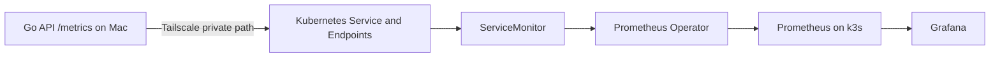

# Prometheus and Grafana across the private network

[Back to the lab](../../README.md) · [Networking](../networking.md) · [PromQL](../observability.md)

The reported monitoring lab placed the Go API and PostgreSQL on a MacBook under Docker Compose. An AWS EC2 Ubuntu host ran k3s, Helm, and `kube-prometheus-stack` (Prometheus, Grafana, Alertmanager, and Prometheus Operator). Prometheus scraped the API's `/metrics` endpoint over Tailscale. The original EC2 cluster configuration and dashboard exports are not checked in; this page gives a reproducible example manifest, not a claim that these exact Kubernetes objects were previously applied.



The Operator watches the `ServiceMonitor` and generates Prometheus scrape configuration. The selectorless Kubernetes `Service` gives the external API a stable name. A matching `Endpoints` object supplies the external Tailscale IP and port. The `ServiceMonitor` selects the Service's `app: mac-go-api` label and scrapes its named `metrics` port every 15 seconds. The Service's `monitoring-job` label supplies `job="mac-go-api"`. Grafana reads from Prometheus; it does not scrape the Mac itself.

Recent Kubernetes versions deprecate the old `Endpoints` API in favor of `EndpointSlice`. This example uses `Endpoints` for broad compatibility with the lab's ServiceMonitor discovery pattern. Check your operator's EndpointSlice discovery setting and RBAC before replacing it. [Kubernetes selectorless Services](https://kubernetes.io/docs/concepts/services-networking/service/#services-without-selectors) and [Prometheus Operator troubleshooting](https://prometheus-operator.dev/docs/platform/troubleshooting/) cover those details.

## Prepare the Mac

Follow [running the lab](../running.md) and [networking](../networking.md). Set `API_BIND_ADDR` in the ignored `.env` to **your own** Mac Tailscale IPv4 address, recreate the API, and verify `/metrics` at that address. PostgreSQL stays on Mac localhost.

## Prepare the EC2 monitor

Provision an Ubuntu EC2 instance and install/join Tailscale using your own account's instructions. Install k3s and Helm. Use vendor installation instructions appropriate to the current OS/version; this repository does not contain an EC2 monitoring bootstrap script. The checked-in [AWS deployment runbook](../aws-deployment.md) is a separate, existing application deployment and uses a different EC2 host setup.

The following assumes k3s and Helm are already installed, your `kubectl` context targets this cluster, and the EC2 host/pods can reach your Mac's Tailscale IP. k3s writes its admin kubeconfig to `/etc/rancher/k3s/k3s.yaml`; handle it as a cluster credential. For k3s/Helm installation details, see [k3s quick start](https://docs.k3s.io/quick-start) and the [Prometheus Community chart](https://github.com/prometheus-community/helm-charts/tree/main/charts/kube-prometheus-stack). Chart versions and default selectors change; pin and review the chart in a real deployment.

Example Helm install for an **empty lab cluster**:

```sh
kubectl create namespace monitoring
helm repo add prometheus-community https://prometheus-community.github.io/helm-charts
helm repo update
helm install monitoring prometheus-community/kube-prometheus-stack \
  --namespace monitoring
kubectl -n monitoring get pods
```

If you already have a release, use its namespace/name and adapt the `release` label in [external-api.yaml](external-api.yaml) to match its ServiceMonitor selector. The example assumes Helm release `monitoring` in namespace `monitoring`. `helm get values monitoring -n monitoring` and `kubectl -n monitoring get prometheus -o yaml` help inspect actual selectors. These installation commands were not executed against the user's AWS cluster during this documentation pass.

## Represent the external API in Kubernetes

The manifest [external-api.yaml](external-api.yaml) contains a placeholder address. Substitute your Mac's Tailscale IPv4 address before applying:

```sh
export MAC_TAILSCALE_IP=YOUR_MAC_TAILSCALE_IP
sed "s/YOUR_MAC_TAILSCALE_IP/$MAC_TAILSCALE_IP/g" \
  docs/monitoring/external-api.yaml | kubectl apply -f -
```

The placeholder must be a plain IPv4 address, without `http://` or `:8080`. Review the rendered YAML before applying in a shared cluster. Verify discovery and endpoint wiring:

```sh
kubectl -n monitoring get service mac-go-api
kubectl -n monitoring get endpoints mac-go-api
kubectl -n monitoring get servicemonitor mac-go-api
kubectl -n monitoring get prometheus
```

Check Prometheus **Status → Targets** for `mac-go-api`; then query:

```promql
up{job="mac-go-api"}
```

`1` means Prometheus successfully scraped `/metrics` at the last scrape. It says nothing about seat-hold latency, successful bookings, or even whether `/readyz` passes. `0` means the scrape failed; no series often means discovery/labels or a time-range issue. If the target is missing, inspect the Prometheus resource's ServiceMonitor namespace/label selectors, the `release` label, the Service's port name, and the Endpoints address. If the target exists but is DOWN, test pod-to-Mac connectivity and the API listener as described in [networking](../networking.md).

The scrape interval is 15 seconds. Short connection-pool events can occur between scrapes, and `rate(...[1m])` needs at least two samples. Generate valid traffic across several scrapes, then compare request status, p95 latency, CPU, and pool activity in Grafana Explore using the [query reference](../observability.md#promql-for-both-incidents). Grafana panels are a view of those same Prometheus series, not independent evidence.

For local-only practice, skip EC2 and scrape the API with any local Prometheus that can reach `/metrics`. The remote path adds a networking investigation: a healthy Tailscale route plus a refused TCP connection can reveal a wrong Docker port binding.
